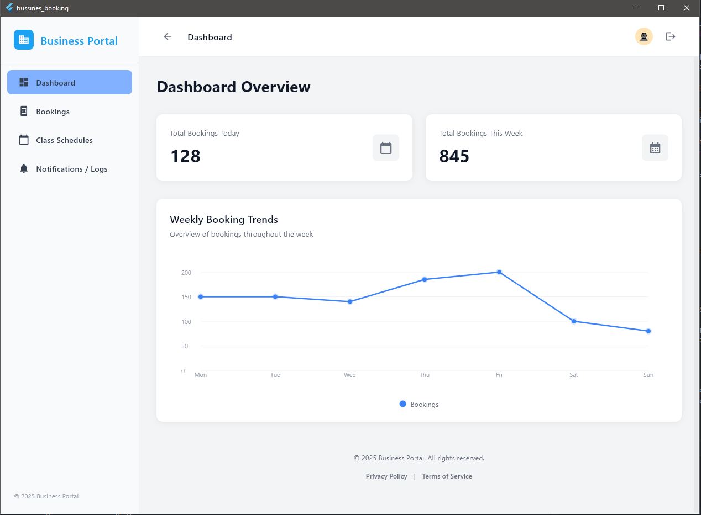
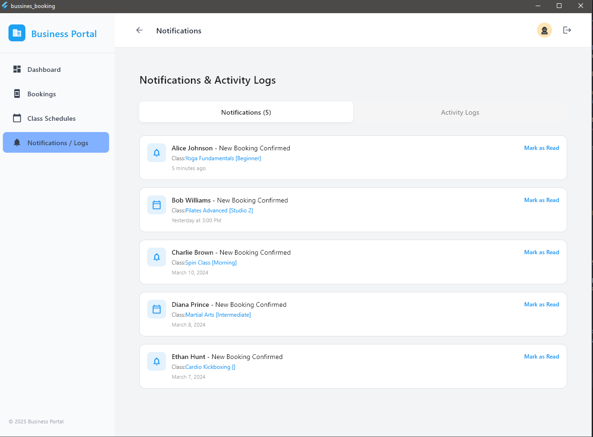
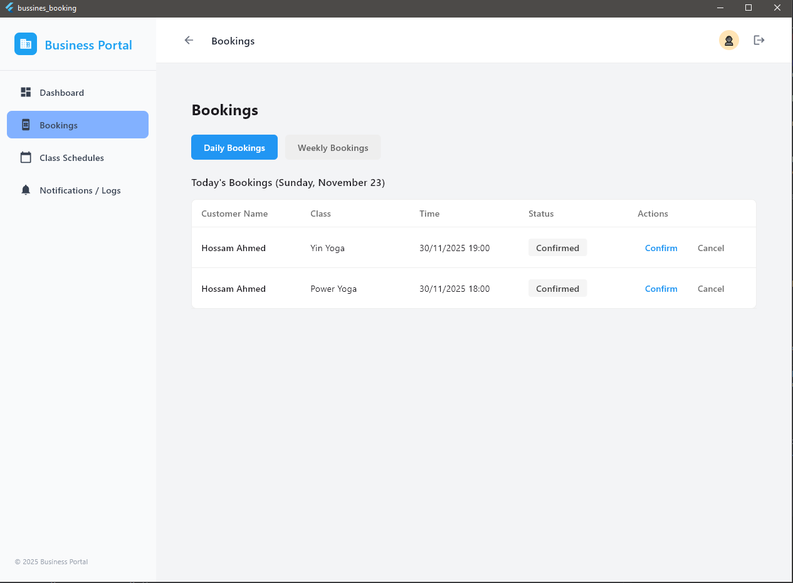
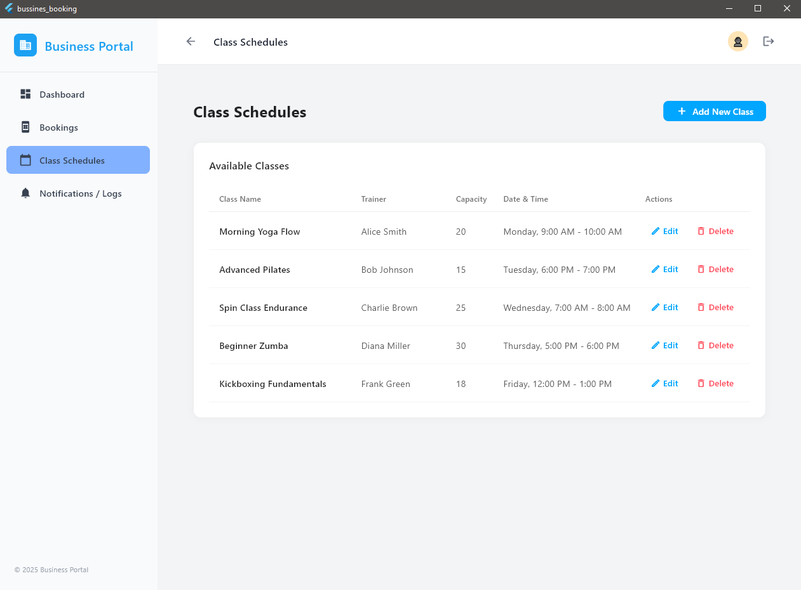

<div align="center">

# 📱 Business Booking App

### A Modern Flutter Application for Seamless Class & Service Bookings

[](https://flutter.dev)
[](https://dart.dev)
[](https://opensource.org/licenses/MIT)
[](https://bloclibrary.dev)

*Built with Clean Architecture principles and modern Flutter best practices*

[Features](#-features) • [Architecture](#-architecture) • [Installation](#%EF%B8%8F-installation--setup) • [Tech Stack](#-tech-stack) • [Contributing](#-contributing)

</div>

---

## 📖 About The Project

**Business Booking** is a feature-rich Flutter mobile application designed to revolutionize the way users book classes, services, and appointments. Built with scalability and maintainability at its core, this app demonstrates professional-grade mobile development with a focus on:

- 🎨 **Modern UI/UX Design** - Intuitive, responsive, and visually appealing interface
- ⚡ **High Performance** - Optimized rendering and efficient state management
- 🏛️ **Clean Architecture** - Separation of concerns with clear layer boundaries
- 🧩 **SOLID Principles** - Maintainable, testable, and extensible codebase
- 🔐 **Enterprise-Grade Security** - Secure authentication and data handling
- 📱 **Cross-Platform** - Single codebase for iOS and Android

This application showcases industry best practices in Flutter development, including proper error handling, dependency injection, and a scalable folder structure that can grow with your business needs.

---

## ✨ Features

### 🔐 **Authentication & User Management**
- Secure user registration and login system
- JWT token-based authentication
- Password recovery and reset functionality
- Session management with auto-logout
- User profile management with edit capabilities

### 📅 **Class & Booking Management**
- Browse available classes and services
- Real-time availability checking
- Quick booking system with instant confirmation
- Booking history and management
- Cancel or reschedule bookings
- Multiple booking support

### 🔔 **Smart Notifications**
- Push notifications for booking confirmations
- Reminder notifications before scheduled classes
- Real-time updates on booking status changes
- In-app notification center

### 🏠 **Home Dashboard**
- Personalized user dashboard
- Quick access to upcoming bookings
- Featured classes and recommendations
- Activity overview and statistics

### 👤 **User Profile**
- Comprehensive profile management
- Booking history and analytics
- Personal preferences and settings
- Account settings and privacy controls

### 🎨 **UI/UX Excellence**
- Smooth animations and transitions
- Responsive layout for all screen sizes
- Custom navigation with drawer menu
- Loading states and skeleton screens
- Empty states with actionable messages
- Error handling with user-friendly messages

### 🔧 **Technical Features**
- Offline-first architecture with local caching
- RESTful API integration with Dio
- Form validation with real-time feedback
- Secure local data storage
- Environment-based configuration
- Deep linking support with Go Router
- State persistence across app restarts

---

## 🏗️ Architecture

This project follows **Clean Architecture** principles, ensuring separation of concerns and making the codebase highly maintainable and testable.

### 📂 Project Structure

```
lib/
├── core/                          # Core functionality shared across features
│   ├── error/                     # Error handling and exceptions
│   ├── models/                    # Shared data models
│   ├── routers/                   # App navigation and routing (Go Router)
│   ├── secrets/                   # Environment variables and API keys
│   └── services/                  # Core services (network, storage, etc.)
│
├── features/                      # Feature-based modular architecture
│   ├── auth/                      # Authentication feature
│   │   ├── data/                  # Data layer (repositories, data sources)
│   │   ├── domain/                # Domain layer (entities, use cases)
│   │   └── presentation/          # Presentation layer (UI, BLoC, widgets)
│   │
│   ├── bookings/                  # Booking management feature
│   ├── classess/                  # Class browsing and details
│   ├── home/                      # Home dashboard
│   ├── notifications/             # Notification system
│   ├── profile/                   # User profile management
│   └── slider_menue/              # Navigation drawer
│
└── main.dart                      # App entry point
```

### 🎯 Architecture Layers

#### **1. Presentation Layer**
- **UI Components**: Widgets, Screens, and Custom Components
- **State Management**: BLoC pattern for predictable state handling
- **View Models**: Business logic presentation

#### **2. Domain Layer**
- **Entities**: Core business models
- **Use Cases**: Business logic implementation
- **Repository Interfaces**: Abstract contracts for data access

#### **3. Data Layer**
- **Repositories**: Concrete implementations of domain contracts
- **Data Sources**: Remote (API) and Local (Cache) data sources
- **Models**: Data transfer objects (DTOs)

### 🔄 Data Flow

```
UI → BLoC (Events) → Use Cases → Repository → Data Source → API/Database
                       ↓
UI ← BLoC (States) ← Use Cases ← Repository ← Data Source ← Response
```

---

## 🛠️ Tech Stack

### **Core Technologies**
| Technology | Purpose | Version |
|------------|---------|---------|
|  | Cross-platform UI framework | 3.8.1+ |
|  | Programming language | 3.8.1+ |

### **State Management & Architecture**
- **flutter_bloc** (^8.1.6) - Predictable state management using BLoC pattern
- **equatable** (^2.0.7) - Value equality for Dart objects
- **dartz** (^0.10.1) - Functional programming (Either, Option types)

### **Navigation & Routing**
- **go_router** (^17.0.0) - Declarative routing with deep linking support

### **Networking & API**
- **dio** (^5.9.0) - Powerful HTTP client with interceptors
- RESTful API integration
- Request/response interceptors
- Error handling middleware

### **Local Storage & Caching**
- **shared_preferences** (^2.5.3) - Persistent key-value storage

### **Configuration & Environment**
- **flutter_dotenv** (^6.0.0) - Environment variable management

### **Utilities**
- **intl** (^0.20.2) - Internationalization and date formatting
- **uuid** (^4.5.0) - Unique identifier generation

### **Development Tools**
- **flutter_lints** (^5.0.0) - Recommended lint rules for Flutter
- **flutter_test** - Widget and unit testing framework

### **Design Principles**
- ✅ Clean Architecture
- ✅ SOLID Principles
- ✅ Dependency Injection (Service Locator pattern)
- ✅ Repository Pattern
- ✅ BLoC Pattern for State Management
- ✅ Feature-First Organization

---

## 🖼️ Screenshots

<div align="center">

### Authentication Flow
<p float="left">
  
</p>

### Main Features
<p float="left">
  
  
  
   
</p>

*Screenshots showcase the clean, modern interface and smooth user experience*

</div>

---

## 🚀 Getting Started

### Prerequisites

Before you begin, ensure you have the following installed:
- **Flutter SDK** (3.8.1 or higher) - [Install Flutter](https://flutter.dev/docs/get-started/install)
- **Dart SDK** (3.8.1 or higher) - Comes with Flutter
- **Android Studio** / **Xcode** - For running on Android/iOS
- **Git** - For version control
- **VS Code** or **Android Studio** - Recommended IDEs

### 🛠️ Installation & Setup

#### 1️⃣ Clone the Repository
```bash
git clone https://github.com/HossamAhmed954074/Business-Bookings-.git
cd bussines_booking
```

#### 2️⃣ Install Dependencies
```bash
flutter pub get
```

#### 3️⃣ Environment Configuration
Create a `.env` file in the root directory:
```env
API_BASE_URL=https://your-api-url.com/api/v1
API_KEY=your_api_key_here
```

#### 4️⃣ Verify Flutter Installation
```bash
flutter doctor
```
Ensure all checks pass. Fix any issues reported by Flutter Doctor.

#### 5️⃣ Run the Application

**For Android:**
```bash
flutter run
```

**For iOS:**
```bash
flutter run -d ios
```

**For a specific device:**
```bash
# List available devices
flutter devices

# Run on specific device
flutter run -d <device_id>
```

#### 6️⃣ Build for Production

**Android APK:**
```bash
flutter build apk --release
```

**Android App Bundle:**
```bash
flutter build appbundle --release
```

**iOS:**
```bash
flutter build ios --release
```

---

## 🧪 Testing

### Run All Tests
```bash
flutter test
```

### Run Tests with Coverage
```bash
flutter test --coverage
```

### Run Widget Tests
```bash
flutter test test/widget_test.dart
```

### Testing Strategy
- ✅ Unit tests for business logic
- ✅ Widget tests for UI components
- ✅ Integration tests for complete user flows
- ✅ BLoC tests for state management

---

## 📱 Supported Platforms

- ✅ **Android** (API 21+)
- ✅ **iOS** (11.0+)
- 🚧 **Web** (In Development)
- 🚧 **Windows** (In Development)

---

## 👨‍💻 About the Developer

Hi! I'm a **passionate Flutter Developer** dedicated to building high-quality, scalable mobile applications.

### 💪 Core Strengths:
- 🎯 **Clean Architecture Expert** - Building maintainable and testable codebases
- 🎨 **UI/UX Focused** - Creating intuitive and beautiful user interfaces
- 🏗️ **Scalable Solutions** - Designing apps that grow with business needs
- 📚 **Best Practices** - Following industry standards and modern Flutter trends
- 🔧 **Problem Solver** - Efficient debugging and optimization skills
- 🚀 **Performance-Oriented** - Writing efficient, optimized code
- 🤝 **Team Player** - Strong collaboration and communication skills

### 🛠️ Technical Expertise:
- State Management: BLoC, Provider, Riverpod
- Clean Architecture & SOLID Principles
- RESTful API Integration
- Firebase Services (Auth, Firestore, Cloud Messaging)
- Local Storage & Caching Strategies
- Git & Version Control
- CI/CD Pipelines
- Unit & Widget Testing

### 📫 Connect with Me:
- **GitHub**: [@HossamAhmed954074](https://github.com/HossamAhmed954074)
- **Email**: hossam.ahmed@example.com
- **LinkedIn**: [Your LinkedIn Profile](https://linkedin.com/in/your-profile)

---

## 🤝 Contributing

Contributions are what make the open-source community such an amazing place to learn, inspire, and create. Any contributions you make are **greatly appreciated**.

### How to Contribute:

1. **Fork the Project**
2. **Create your Feature Branch** (`git checkout -b feature/AmazingFeature`)
3. **Commit your Changes** (`git commit -m 'Add some AmazingFeature'`)
4. **Push to the Branch** (`git push origin feature/AmazingFeature`)
5. **Open a Pull Request**

### Coding Standards:
- Follow Dart/Flutter style guidelines
- Write meaningful commit messages
- Add tests for new features
- Update documentation as needed
- Ensure all tests pass before submitting

---

## 📄 License

This project is licensed under the **MIT License** - see the [LICENSE](LICENSE) file for details.

```
MIT License

Copyright (c) 2025 Hossam Ahmed

Permission is hereby granted, free of charge, to any person obtaining a copy
of this software and associated documentation files (the "Software"), to deal
in the Software without restriction, including without limitation the rights
to use, copy, modify, merge, publish, distribute, sublicense, and/or sell
copies of the Software, and to permit persons to whom the Software is
furnished to do so, subject to the following conditions:

The above copyright notice and this permission notice shall be included in all
copies or substantial portions of the Software.

THE SOFTWARE IS PROVIDED "AS IS", WITHOUT WARRANTY OF ANY KIND, EXPRESS OR
IMPLIED, INCLUDING BUT NOT LIMITED TO THE WARRANTIES OF MERCHANTABILITY,
FITNESS FOR A PARTICULAR PURPOSE AND NONINFRINGEMENT. IN NO EVENT SHALL THE
AUTHORS OR COPYRIGHT HOLDERS BE LIABLE FOR ANY CLAIM, DAMAGES OR OTHER
LIABILITY, WHETHER IN AN ACTION OF CONTRACT, TORT OR OTHERWISE, ARISING FROM,
OUT OF OR IN CONNECTION WITH THE SOFTWARE OR THE USE OR OTHER DEALINGS IN THE
SOFTWARE.
```

---

## 🙏 Acknowledgments

- [Flutter Team](https://flutter.dev) - For the amazing framework
- [BLoC Library](https://bloclibrary.dev) - For state management solution
- [Dio](https://pub.dev/packages/dio) - For powerful HTTP client
- [Go Router](https://pub.dev/packages/go_router) - For declarative routing
- All open-source contributors who made this project possible

---

## 📞 Support

If you encounter any issues or have questions:

- 📧 **Email**: eltohamehossam@gmail.com
- 🐛 **Bug Reports**: [GitHub Issues](https://github.com/HossamAhmed954074/Business-Bookings-/issues)
- 💬 **Discussions**: [GitHub Discussions](https://github.com/HossamAhmed954074/Business-Bookings-/discussions)

---

<div align="center">

### ⭐ If you found this project helpful, please give it a star!

**Made with ❤️ and Flutter**


</div>
